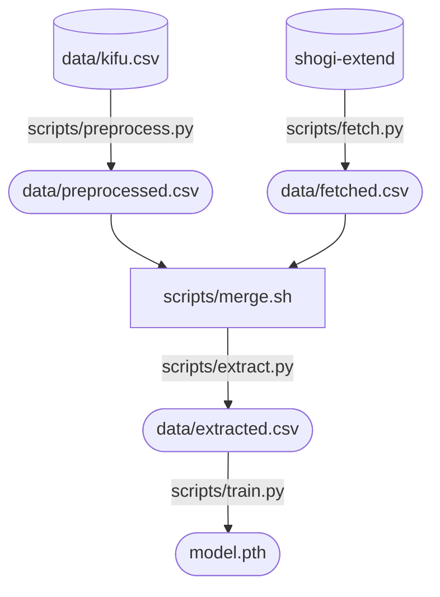

# bram-model

## 環境設定手順

### 1. 環境変数ファイルの作成

```bash
cp .env.sample .env
```

`.env` の `BASE_IMAGE` を適切なイメージに設定する．

### 2. コンテナの起動

```bash
docker compose up -d --build
```

`--build` は初回のみ

### 3. devcontainer の起動

コマンドパレット (F1 or ⌘+⇧+P) から `Remote-Containers: Reopen in Container` を選択する．


## モデル構築手順

以下のコマンドを実行する．

```bash
sh scripts/pipeline.sh
```

処理の概要を以下に示す．



## Note

| スクリプト              | 説明                 |
| ----------------------- | -------------------- |
| `scripts/fetch.py`      | 似た棋譜データの収集 |
| `scripts/preprocess.py` | データの前処理       |
| `scripts/merge.sh`      | データの結合         |
| `scripts/extract.py`    | データの抽出         |
| `scripts/train.py`      | モデルの学習         |
